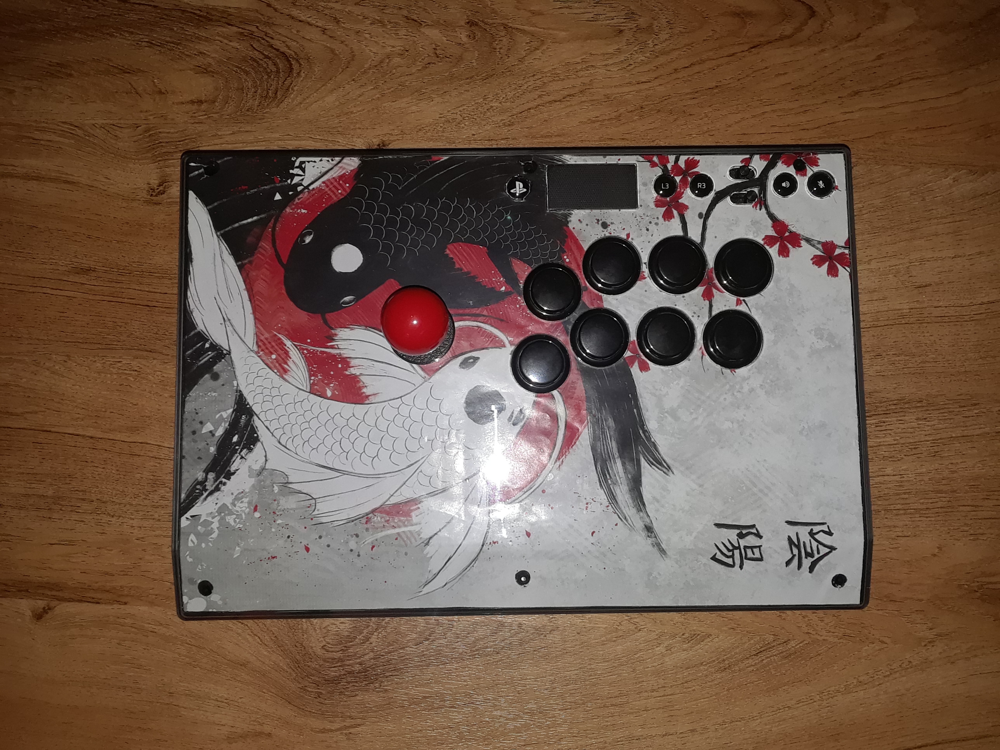

  Fighting games have always been an interest for me. Having the ability to best your opponent using many types of strategies and skills was one of the coolest things you could ever do in a video game. It was only recently in the year 2018 when I started to take my interest and push it even further by getting more involved with genre of gaming. One day, my roommate asked if I wanted to join him to visit his friend's house. He told me that his friend is a top player in Hawaii. I went into it thinking that it was going to be a fun challenge, considering that Hawaii does not have much competition due to it being so isolated... I GOT BOPPED. However, that harsh loss lit a burning flame within me, as if I had the determination of a thousand men. Through the help with my roommate's friend and his group of other players, I was able to improve by a lot within a year.
 
 One thing I noticed though was that the arcade stick that I played on was losing its value due to how worn out it was becoming.  This is because the stick I bought was cheap one that I ordered from Amazon. Eventually, I thought a upgrade was about time. Through some time saving, I was able to purchase a Razer Panthera Evo edition. Although the stick felt amazing on, I thought that the stock look that it had was very plain and boring. During a convention, I sought out to find a piece of art that I could use as the cover for my fight stick. It took days within the convention, until eventually, I found the piece that I thought was spectacular. When I got home, I did a little trimming here and there until I was able to create a controller that looked SICK. My skills have not improved a single a bit from doing that, but it does make playing games on it a lot more fun.  

